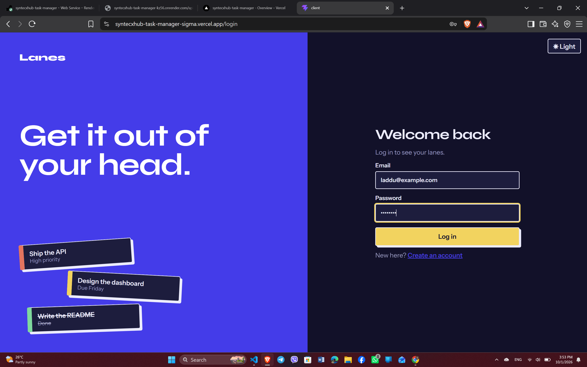
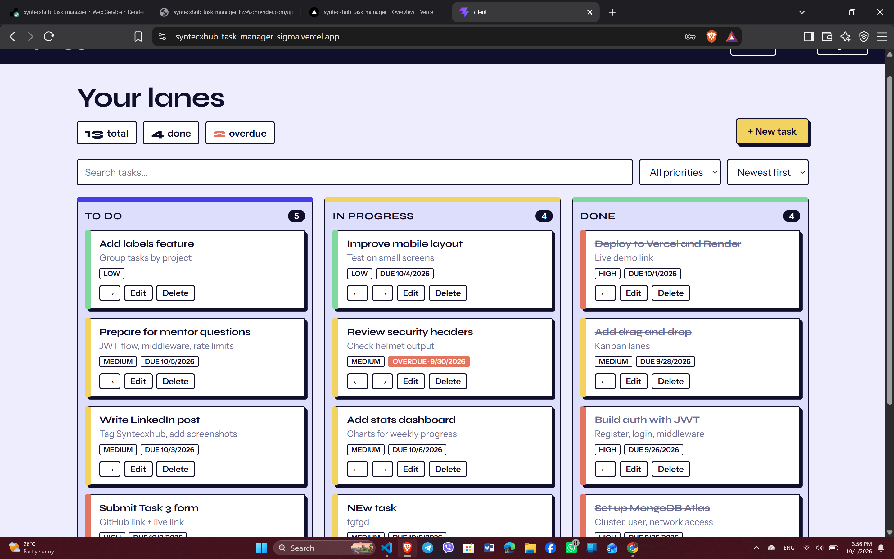
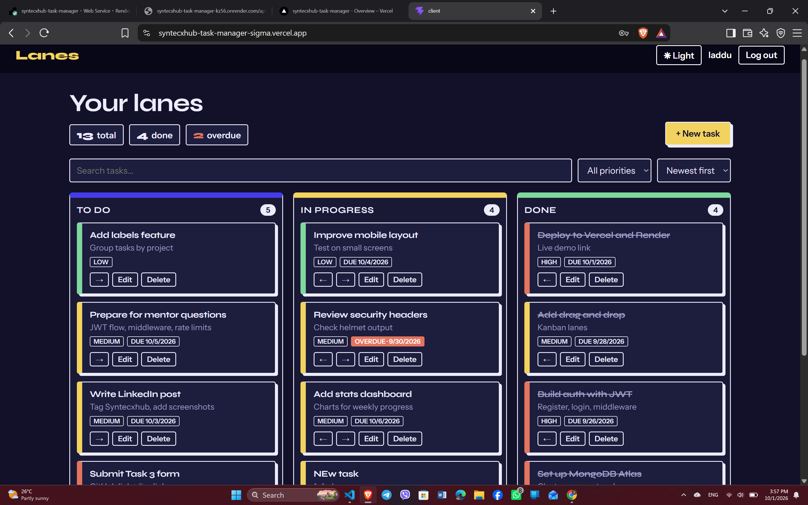
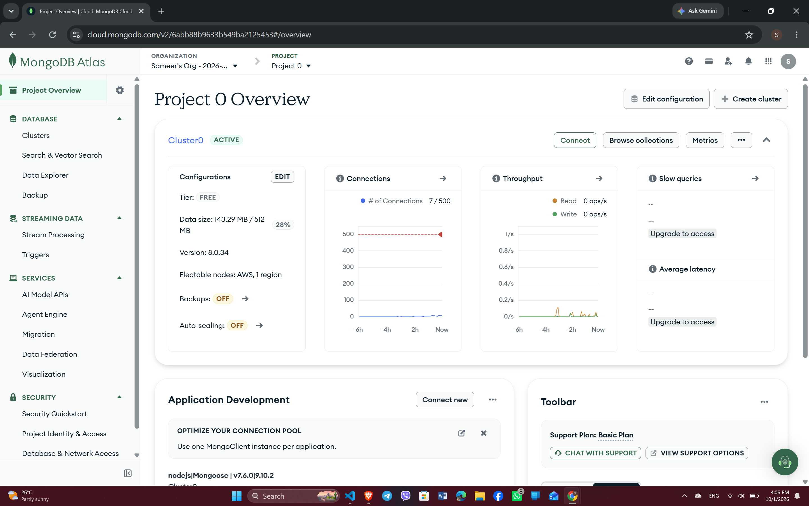

# Lanes: Task Manager (Syntecxhub Task 3, Project 1)

A full-stack task manager built with the MERN stack. Users register, log in, and organize their own tasks on a drag-and-drop Kanban board.

**Live demo:** https://syntecxhub-task-manager-sigma.vercel.app
**API health check:** https://syntecxhub-task-manager-kz56.onrender.com/api/health

> The API runs on a free Render instance, so the first request after inactivity can take up to a minute.

## Screenshots






## Features

- JWT authentication with bcrypt-hashed passwords
- Auth middleware protecting every task endpoint; users only see their own tasks
- Create, read, update and delete tasks
- Kanban board with drag and drop between To do / In progress / Done
- Search, priority filter and sorting (newest, due date, priority)
- Overdue detection and live stats
- Dark mode (saved preference, follows the system setting by default)
- Toast notifications, loading and error states, optimistic updates with rollback
- Automatic logout when a token expires
- Server hardening: helmet, rate limiting on auth routes, request size limit, safe error handling

## Tech Stack

- **Frontend:** React (Vite), React Router, Axios, @hello-pangea/dnd, react-hot-toast
- **Backend:** Node.js, Express, Mongoose
- **Database:** MongoDB Atlas
- **Auth and security:** JWT, bcryptjs, helmet, express-rate-limit
- **Deployment:** Vercel (frontend), Render (backend)

## Run Locally

```bash
git clone https://github.com/rustamtimalsina/Syntecxhub_Task_Manager.git
cd Syntecxhub_Task_Manager
```

**Backend**
```bash
cd server
npm install
```
Create `server/.env` (see `.env.example`):
```
PORT=5001
MONGO_URI=your_mongodb_connection_string
JWT_SECRET=your_secret_key
```
```bash
npm run dev
```

**Frontend** (new terminal)
```bash
cd client
npm install
npm run dev
```
Open http://localhost:5173

## API

| Method | Endpoint | Auth | Description |
|---|---|---|---|
| POST | /api/auth/register | No | Create an account |
| POST | /api/auth/login | No | Log in and receive a token |
| GET | /api/auth/me | Yes | Current user |
| GET | /api/tasks | Yes | List your tasks |
| POST | /api/tasks | Yes | Create a task |
| PUT | /api/tasks/:id | Yes | Update a task |
| DELETE | /api/tasks/:id | Yes | Delete a task |

Send the token as `Authorization: Bearer <token>`.

## Author

Rustam Timalsina